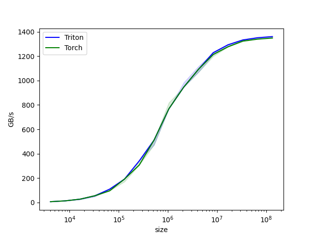
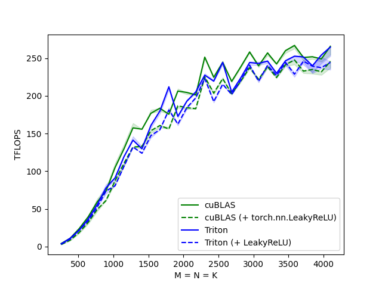
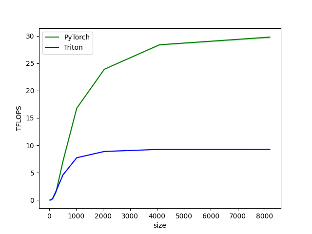
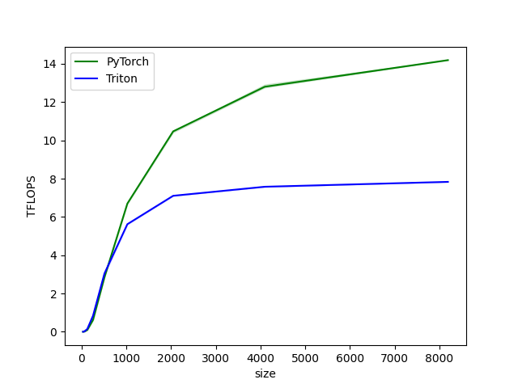

### Baseline
First, to make sure I have everything setup correctly on my system, I reproduced the vector element-wise addition and matrix multiplication benchmarks from the tutorials. All of the benchmarks in this doc were run on a single A100 machine on GCP with triton built from the commit `3fa8a5a864c48a490625648387a86be3eb7c2c06`.

Vector element-wise addition on my A100 machine:

This compares favorably to [the same benchmark in the tutorials](https://triton-lang.org/master/getting-started/tutorials/01-vector-add.html). My machine achieves 1400 GB/s at 10**8 sized vector, whereas the tutorial achieves 800 GB/s at that size.

Matrix-matrix product on my A100 machine:

This again compares favorably to the absolute values of [the same benchmark in the tutorials](https://triton-lang.org/master/getting-started/tutorials/03-matrix-multiplication.html). My machine achieves 250 TFLOPS at size 4000, whereas the tutorial achieves 90TFLOPS at that size. However, the superiority of the triton kernel over the cuBLAS is less clear in my results.

### Partial GELU Layer Performance

#### Forward
This is the forward pass of pytorch and triton.

It's unfortunate that the triton performance here is considerably worse than the pytorch performance. I wonder if it is related to [this](https://github.com/openai/triton/issues/984) issue where the author notes that having two accumulators in the same matmul kernel breaks performance. In the forward pass I'm accumulating the left side into `z1` and the right side into `z2`. While the triton benchmarks run, I see 100% GPU utilization in nvidia-smi, so it doesn't appear to be an issue with loading data or Python computation.

#### Backward
This is the backward pass of pytorch and the two triton kernels in serial. The first kernel does the element-wise computations and the second kernel does the matmuls.

Again the results are similarly worse than PyTorch. My current hunch is that it may be the same issue with having multiple accumulators in the matmul. In this case it is the accumulators for `dW1` and `dW2`. 
